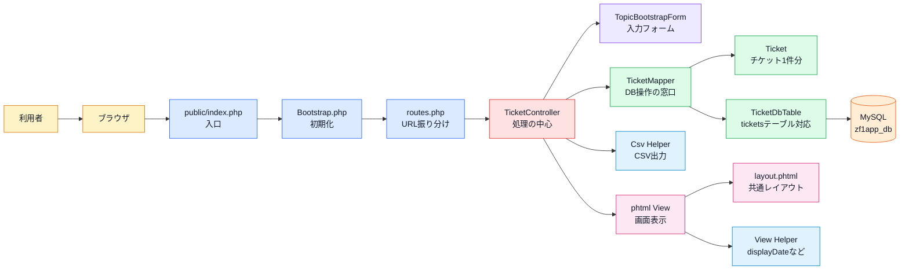
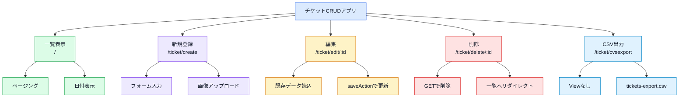
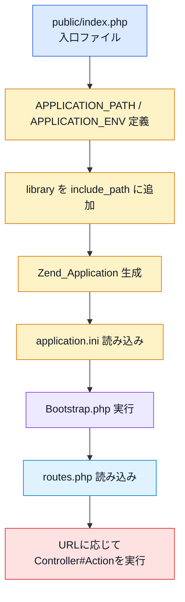
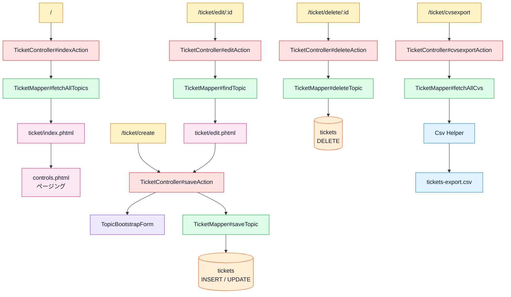
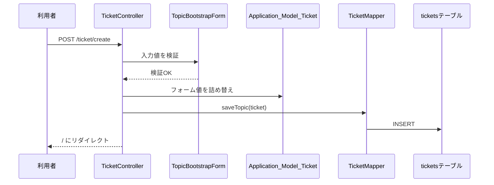
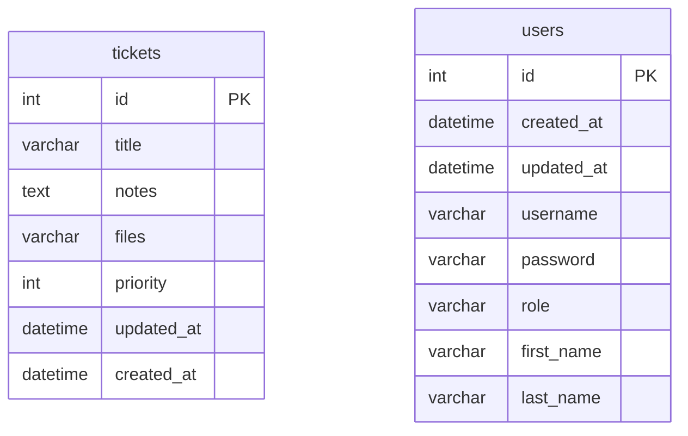
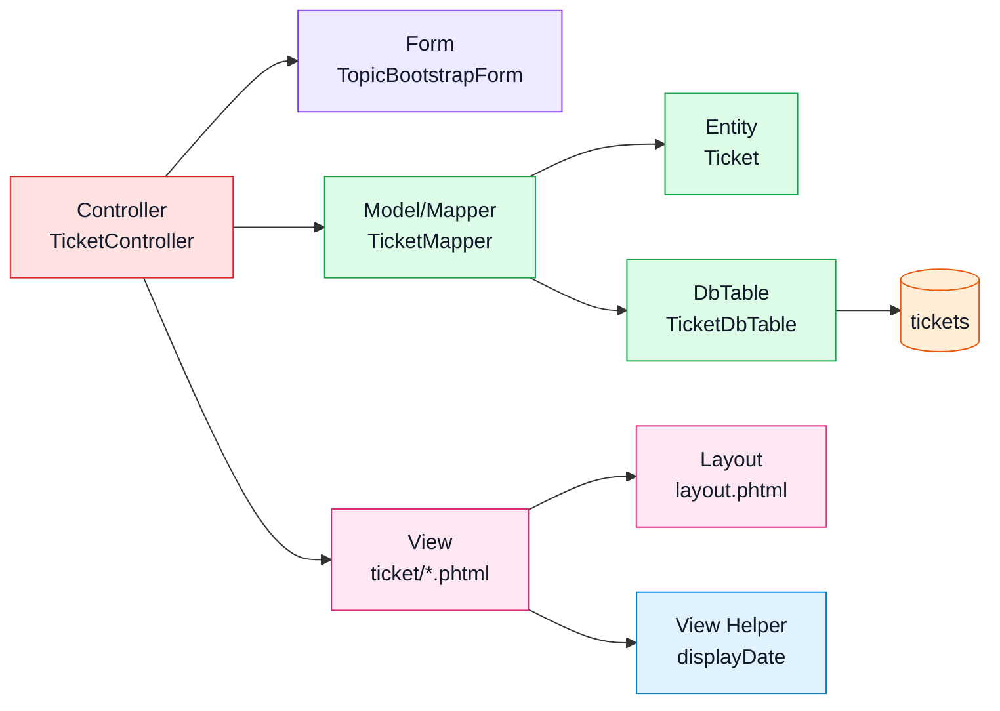

# プログラム概要

対象アプリ: `zend-framework-1-crud-master`

## このアプリの概要

Zend Framework 1 で作られた、チケット管理用のCRUDサンプルアプリ。

主な機能は次の通り。

- チケット一覧表示
- チケット新規登録
- チケット編集
- チケット削除
- 画像ファイルアップロード
- 一覧のページング
- チケット情報のCSV出力

README上では「Zend Framework 1 ticket application extras (upload,pagination,cvs export)」と説明されている。

## ひと目で見る全体像



この図で見ると、読むべき中心は `TicketController`、`TopicBootstrapForm`、`TicketMapper`、`Ticket`、`TicketDbTable`。

## 主要機能マップ



## 使用している主な技術

| 種類 | 内容 |
| --- | --- |
| フレームワーク | Zend Framework 1 |
| バージョン | Zend Framework 1.12.20 |
| 言語 | PHP |
| DB | MySQL |
| DB接続 | `PDO_MySQL` |
| 画面 | Zend_View + phtml |
| レイアウト | Zend_Layout |
| フォーム | Zend_Form |
| DBテーブル操作 | Zend_Db_Table_Abstract |
| ページング | Zend_Paginator |
| ファイルアップロード | Zend_File_Transfer_Adapter_Http |

## ファイル構成の概要

詳しいファイル構成は [03_ファイル構成.md](03_ファイル構成.md) に分けて整理する。

このアプリでは、`public/index.php` が入口で、`application` 配下にController、Model、View、設定ファイルが置かれている。

## アプリ起動の概要

入口は `public/index.php`。

`public/index.php` は、アプリケーションパスと環境を定義し、Zend Framework のライブラリを読み込んでから `Zend_Application` を起動する。

```text
public/index.php
↓
application/configs/application.ini
↓
application/Bootstrap.php
↓
application/configs/routes.php
↓
Controller
```



設定ファイル `application.ini` では、Controllerディレクトリ、Layout、View、DB接続情報などを定義している。

## 主要機能



### 1. チケット一覧

URL: `/`

処理担当:

- `TicketController#indexAction`
- `TicketMapper#fetchAllTopics`
- `TicketDbTable`
- `views/scripts/ticket/index.phtml`
- `views/scripts/controls.phtml`

DBの `tickets` テーブルからチケットを `id DESC` で取得し、`Zend_Paginator` で5件ずつ表示する。

一覧には次の項目が表示される。

- Title
- Notes
- Date
- Editボタン
- Deleteボタン

日付表示には `Zend_View_Helper_DisplayDate` が使われている。

### 2. チケット新規登録

URL: `/ticket/create`

処理担当:

- `TicketController#saveAction`
- `Application_Form_TopicBootstrapForm`
- `TicketMapper#saveTopic`
- `views/scripts/ticket/save.phtml`

GET時は登録フォームを表示する。

POST時はフォーム値を検証し、`Application_Model_Ticket` に詰め替えて `tickets` テーブルへINSERTする。



登録フォームの主な項目:

| 項目 | 内容 |
| --- | --- |
| `id` | hidden。編集時に使用する。 |
| `title` | タイトル。必須。 |
| `notes` | 内容。必須。 |
| `priority` | 優先度。Low / Normal / High / Emergency。 |
| `files` | 画像ファイル。jpg / png / gif。必須。 |
| `csrf` | CSRF対策用hash。 |

### 3. チケット編集

URL: `/ticket/edit/:id`

処理担当:

- `TicketController#editAction`
- `TicketMapper#findTopic`
- `views/scripts/ticket/edit.phtml`

GETで対象チケットを読み込み、フォームに既存データを入れて表示する。

編集フォームの送信先は `/ticket/create`。

更新処理自体は `saveAction` が担当する。hidden項目の `id` がある場合、`TicketMapper#saveTopic` 内でUPDATEになる。

### 4. チケット削除

URL: `/ticket/delete/:id`

処理担当:

- `TicketController#deleteAction`
- `TicketMapper#deleteTopic`

GETリクエストで指定IDのチケットを削除する。

削除後は成功/失敗メッセージを `FlashMessenger` に入れて `/` にリダイレクトする。

### 5. CSV出力

URL: `/ticket/cvsexport`

処理担当:

- `TicketController#cvsexportAction`
- `TicketMapper#fetchAllCvs`
- `Zend_Controller_Action_Helper_Csv`

`tickets` テーブルからチケット一覧を取得し、CSVとしてダウンロード出力する。

CSVの列は次の通り。

- ID
- TITLE
- NOTES

出力ファイル名は `tickets-export.csv` になる。

## DB概要

SQL定義ファイルは `zf1app_db.sql`。

主に使われているテーブルは `tickets`。

```text
tickets
├─ id
├─ title
├─ notes
├─ files
├─ priority
├─ updated_at
└─ created_at
```

`users` テーブルもSQL内に定義されているが、このアプリの主要なCRUD処理では使われていない。



## MVCの役割



### Controller

`TicketController.php` が中心。

URLごとの処理を受け取り、必要に応じてフォーム・モデル・ヘルパーを呼び出す。

| Action | 役割 |
| --- | --- |
| `indexAction` | チケット一覧表示 |
| `saveAction` | 新規登録・更新 |
| `editAction` | 編集フォーム表示 |
| `deleteAction` | 削除 |
| `cvsexportAction` | CSV出力 |

`IndexController.php` も存在するが、トップページ `/` は `routes.php` で `TicketController#indexAction` に割り当てられているため、通常の入口としては使われない。

`ErrorController.php` は404や500などのエラー表示を担当する。

### Model

`Ticket.php` はチケット1件分のデータを表すモデル。

`TicketMapper.php` はControllerとDBテーブルの橋渡しをする。取得、登録、更新、削除、CSV用データ取得を担当する。

`TicketDbTable.php` は `Zend_Db_Table_Abstract` を継承し、DBテーブル `tickets` に対応する。

### View

画面テンプレートは `application/views/scripts` 配下にある。

| ファイル | 役割 |
| --- | --- |
| `ticket/index.phtml` | チケット一覧 |
| `ticket/save.phtml` | 新規登録フォーム |
| `ticket/edit.phtml` | 編集フォーム |
| `ticket/delete.phtml` | 削除用ビュー。ただし実際は削除後すぐリダイレクトするためほぼ使われない。 |
| `controls.phtml` | ページング部品 |
| `error/error.phtml` | エラー画面 |

共通レイアウトは `application/layouts/scripts/layout.phtml`。

ここでナビゲーション、CSS/JS読み込み、FlashMessengerの表示、各画面の本文出力を行う。

## 補助クラス・ヘルパー

| ファイル | 内容 |
| --- | --- |
| `application/helpers/Csv.php` | CSVダウンロード出力用のAction Helper。 |
| `application/helpers/Multiples.php` | 数値計算のテスト用らしきAction Helper。現在の主要処理では使われていない。 |
| `views/helpers/DisplayDate.php` | 日付表示用View Helper。一覧画面で使用。 |
| `views/helpers/DisplayDateLab.php` | 日付表示用View Helper。DisplayDateと似ている。 |
| `views/helpers/ActionErrors.php` | actionErrors表示用。 |
| `views/helpers/DisplayAddress.php` | 住所表示用。チケット機能では未使用。 |
| `views/helpers/LoggedInUser.php` | ログインユーザー表示用。ただし対応するAuthControllerやUsersモデルは見当たらない。 |
| `views/helpers/menuList.php` | メニューリストHTML生成用。 |

## このプログラムの特徴

- Zend Framework 1 の基本的なMVC構成で作られている。
- `routes.php` でURLを明示的に定義している。
- `TicketController#saveAction` が新規登録と更新を兼ねている。
- `TicketMapper` パターンで、Controllerから直接DBを触らない構成になっている。
- フォーム生成に `Zend_Form` を使っている。
- 一覧ページングに `Zend_Paginator` を使っている。
- CSV出力はViewを描画せず、Action Helperから直接レスポンスを返す。

## 気になる点・注意点

- 削除処理がGETで実行されるため、実運用ではPOST化や確認画面が必要。
- `deleteTopic($id)` は `"id = $id"` の文字列で条件を組み立てているため、安全性の観点ではプレースホルダ形式が望ましい。
- ファイルアップロード後、リネームフィルタの適用タイミングやDBへ保存するファイル名の扱いは精査が必要。
- `users` テーブルやログイン系View Helperがあるが、対応するController/Modelが揃っておらず、現在のチケットCRUDとは直接つながっていない。
- `routes.php` のルート名に `labs/create` などの名前が残っており、実URLの `ticket/create` と命名がずれている。
- `IndexController` と `index/index.phtml` は存在するが、トップページの実処理では使われていない。
- READMEでは `cvs export` と書かれている箇所があるが、実際の意図は `csv export` と思われる。
