# プログラムの流れ

対象アプリ: `zend-framework-1-crud-master`

## 最初に解析したファイル

```text
public/index.php
↓
application/configs/application.ini
↓
application/Bootstrap.php
↓
application/configs/routes.php
↓
application/controllers/TicketController.php
↓
application/models/TicketMapper.php
↓
application/models/DbTable/TicketDbTable.php
↓
application/models/Ticket.php
↓
application/views/scripts/ticket/*.phtml
↓
application/layouts/scripts/layout.phtml
```

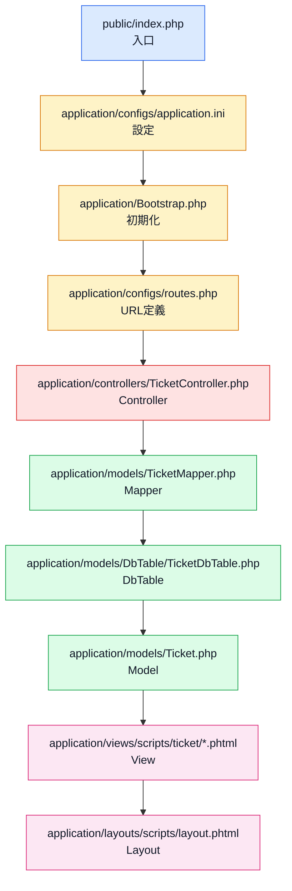

## 全体の入口

```text
ブラウザからアクセス
↓
public/index.php
  - APPLICATION_PATH を定義
  - APPLICATION_ENV を定義
  - library を include_path に追加
  - Zend/Application.php を読み込み
↓
Zend_Application を作成
↓
application/configs/application.ini を読み込み
↓
$application->bootstrap()->run()
```

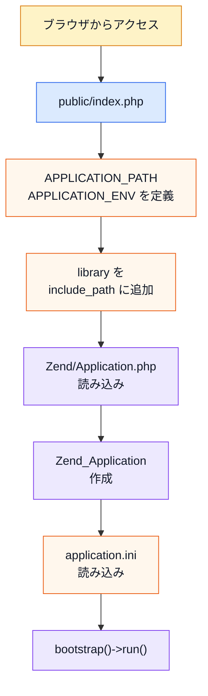

## Bootstrapの流れ

```text
application/Bootstrap.php
↓
_initDoctype()
  - Viewを初期化
  - doctypeを XHTML1_STRICT に設定
↓
_initRoutes()
  - FrontControllerのRouterを取得
  - application/configs/routes.php を読み込み
↓
_initUploadDirAndConstant()
  - application/uploads がなければ作成
  - UPLOAD_PATH 定数を定義
```

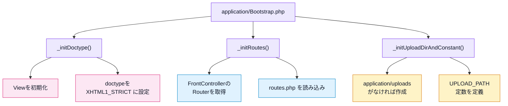

## ルーティングの流れ

```text
application/configs/routes.php
↓
/ 
  → TicketController#indexAction
↓
/ticket/create
  → TicketController#saveAction
↓
/ticket/edit/:id
  → TicketController#editAction
↓
/ticket/delete/:id
  → TicketController#deleteAction
↓
/ticket/cvsexport
  → TicketController#cvsexportAction
```

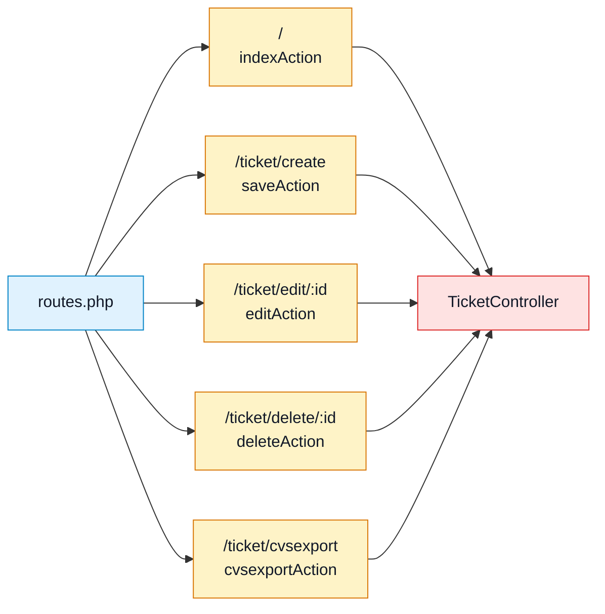

## 一覧表示の流れ

```text
GET /
↓
routes.php
↓
TicketController#indexAction
↓
Application_Model_TicketMapper を作成
↓
TicketMapper#fetchAllTopics()
↓
TicketDbTable
↓
DBテーブル tickets から id DESC で取得
↓
取得した行を Application_Model_Ticket に詰め替え
↓
Zend_Paginator でページング
↓
view に blogTopics を渡す
↓
application/views/scripts/ticket/index.phtml
↓
application/views/scripts/controls.phtml
↓
application/layouts/scripts/layout.phtml
↓
チケット一覧画面を表示
```

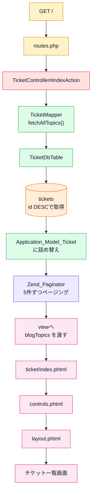

## 新規作成の流れ

```text
GET /ticket/create
↓
routes.php
↓
TicketController#saveAction
↓
Application_Form_TopicBootstrapForm を作成
↓
application/views/scripts/ticket/save.phtml
↓
チケット作成フォームを表示
```

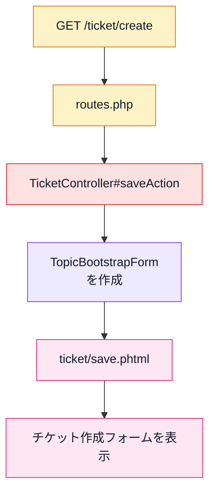

```text
POST /ticket/create
↓
TicketController#saveAction
↓
フォーム入力を検証
↓
Application_Model_Ticket にフォーム値を詰める
↓
アップロードファイルを受け取る
↓
TicketMapper#saveTopic()
↓
id がないため insert
↓
TicketDbTable
↓
DBテーブル tickets に登録
↓
FlashMessenger に成功/失敗メッセージを追加
↓
/ にリダイレクト
```

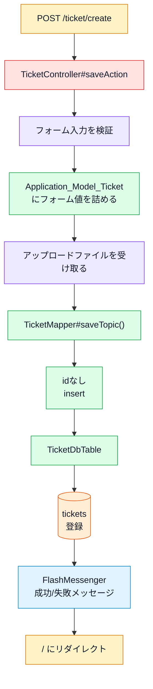

## 編集の流れ

```text
GET /ticket/edit/:id
↓
routes.php
↓
TicketController#editAction
↓
Application_Form_TopicBootstrapForm を作成
↓
TicketMapper#findTopic(id)
↓
TicketDbTable
↓
DBテーブル tickets から対象idを取得
↓
フォームに既存データを populate
↓
application/views/scripts/ticket/edit.phtml
↓
編集フォームを表示
```

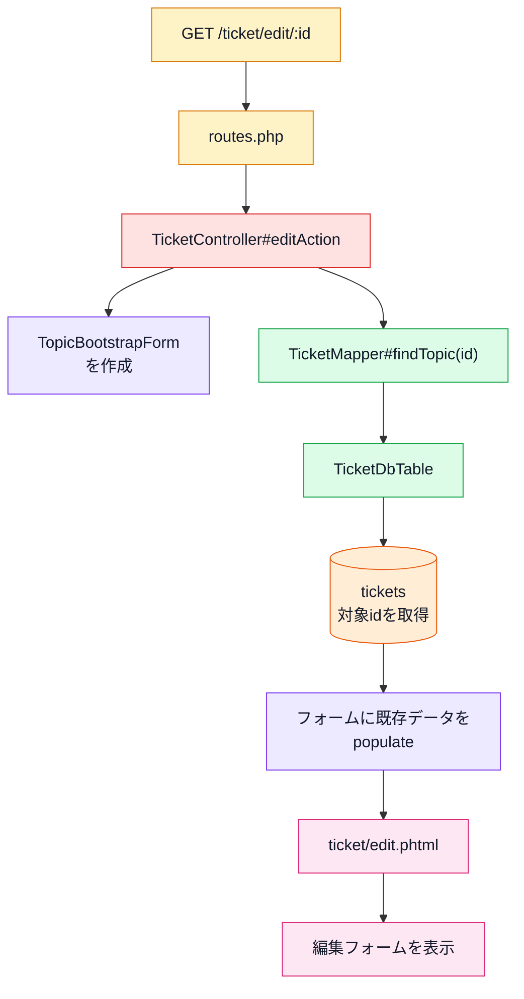

```text
POST /ticket/create
↓
TicketController#saveAction
↓
hidden の id を取得
↓
Application_Model_Ticket にフォーム値を詰める
↓
TicketMapper#saveTopic()
↓
id があるため update
↓
TicketDbTable
↓
DBテーブル tickets を更新
↓
/ にリダイレクト
```

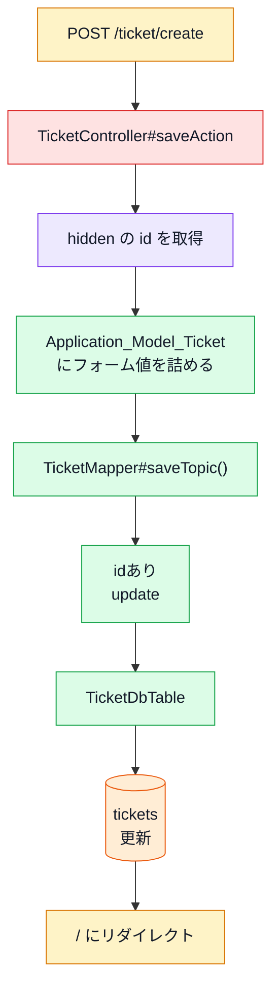

## 削除の流れ

```text
GET /ticket/delete/:id
↓
routes.php
↓
TicketController#deleteAction
↓
リクエストから id を取得
↓
TicketMapper#deleteTopic(id)
↓
TicketDbTable
↓
DBテーブル tickets から対象idを削除
↓
FlashMessenger に成功/失敗メッセージを追加
↓
/ にリダイレクト
```

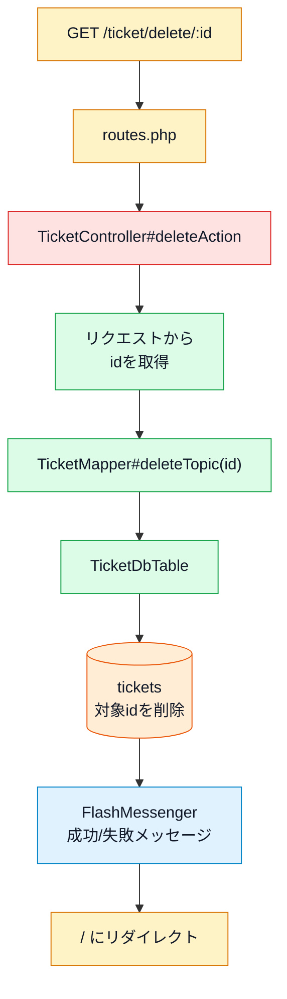

## CSV出力の流れ

```text
GET /ticket/cvsexport
↓
routes.php
↓
TicketController#cvsexportAction
↓
Application_Model_TicketMapper を作成
↓
TicketMapper#fetchAllCvs()
↓
TicketDbTable
↓
DBテーブル tickets から id DESC で取得
↓
配列形式に変換
↓
viewRenderer->setNoRender()
↓
Csv helper を呼び出す
↓
tickets.csv 相当のCSVを出力
```

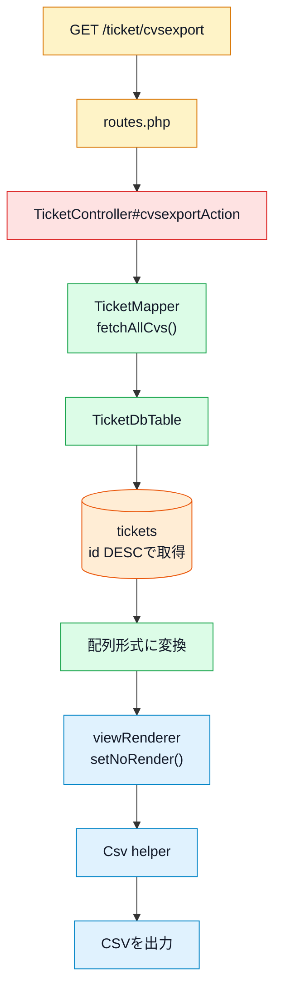

## MVCごとの役割

```text
Controller
  TicketController.php
  - URLごとの処理を受け持つ
  - Modelを呼び出す
  - Viewへ表示データを渡す
  - 登録/更新/削除後にリダイレクトする

Model
  Ticket.php
  - チケット1件分のデータ入れ物

  TicketMapper.php
  - ControllerとDBテーブルの間をつなぐ
  - fetchAllTopics / findTopic / saveTopic / deleteTopic / fetchAllCvs を持つ

  DbTable/TicketDbTable.php
  - Zend_Db_Table_Abstract
  - DBテーブル tickets に対応する

View
  views/scripts/ticket/index.phtml
  views/scripts/ticket/save.phtml
  views/scripts/ticket/edit.phtml
  views/scripts/controls.phtml
  - 画面HTMLを組み立てる

Layout
  layouts/scripts/layout.phtml
  - 共通レイアウト
  - ナビゲーション
  - CSS/JS読み込み
  - FlashMessenger表示
```

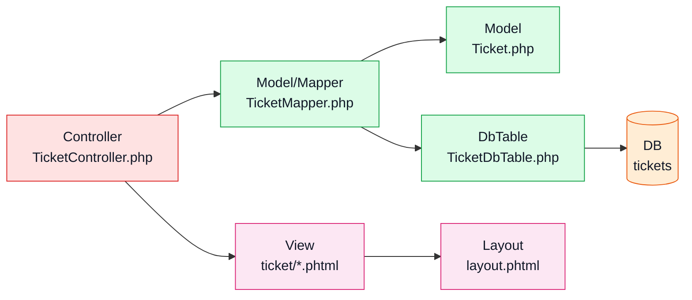

## 重要ポイント

- アプリの入口は `public/index.php`。
- URLの割り当ては `application/configs/routes.php`。
- トップページ `/` は `IndexController` ではなく `TicketController#indexAction` に流れる。
- 登録と更新はどちらも `TicketController#saveAction` が担当する。
- 編集画面のPOST先は `/ticket/create`。hidden項目の `id` の有無で insert/update が分かれる。
- DBアクセスは `TicketMapper.php` から `TicketDbTable.php` を通して行われる。
- 実テーブル名は `tickets`。
