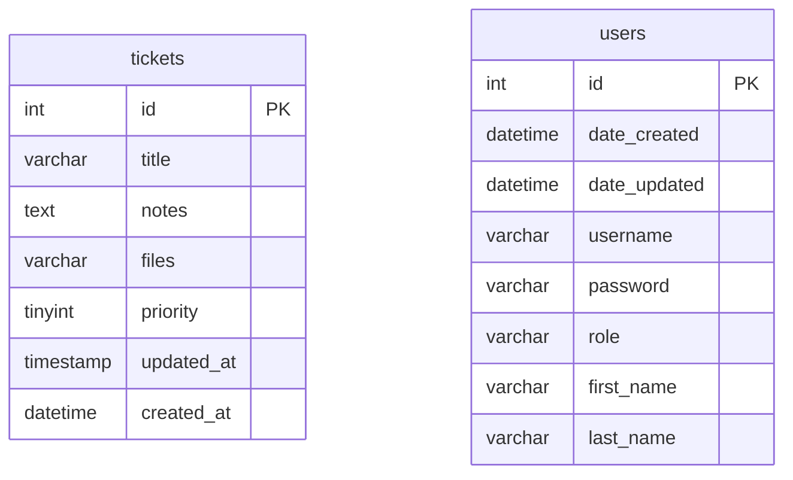

# データベース

対象SQL: `zend-framework-1-crud-master/zf1app_db.sql`

## データベース概要

SQL上のデータベース名は `zf1app_db`。

定義されているテーブルは次の2つ。

| テーブル名 | 用途 | アプリ内での使用状況 |
| --- | --- | --- |
| `tickets` | チケット情報を保存するメインテーブル | 使用されている |
| `users` | ユーザー情報を保存するテーブル | SQLにはあるが、現在の主要CRUD処理では使われていない |

このアプリの中心は `tickets` テーブル。

`users` テーブルも存在するが、対応するControllerやModelが見当たらないため、現在のチケットCRUD機能とは直接つながっていない。

## ER図

外部キー定義はSQL内に存在しない。

そのため、ER図上も `tickets` と `users` の間に明示的なリレーションはない。



## テーブル一覧

### tickets

チケット情報を保存するメインテーブル。

アプリ内では `Application_Model_DbTable_TicketDbTable` がこのテーブルに対応している。

```php
protected $_name = 'tickets';
```

| カラム名 | 型 | NULL | キー | デフォルト | 内容 |
| --- | --- | --- | --- | --- | --- |
| `id` | `int(11)` | NO | PRIMARY KEY | AUTO_INCREMENT | チケットID |
| `title` | `varchar(255)` | YES |  | NULL | チケットタイトル |
| `notes` | `text` | YES |  | NULL | チケット本文 |
| `files` | `varchar(255)` | YES |  | NULL | アップロードファイル名 |
| `priority` | `tinyint(1)` | YES |  | NULL | 優先度。1=Low、2=Normal、3=High、4=Emergency |
| `updated_at` | `timestamp` | YES |  | NULL / ON UPDATE CURRENT_TIMESTAMP | 更新日時 |
| `created_at` | `datetime` | YES |  | NULL | 作成日時 |

#### tickets とプログラムの対応

| DBカラム | Modelのプロパティ | Form項目 | 備考 |
| --- | --- | --- | --- |
| `id` | `$_id` | `id` | hidden項目。編集時に使用。 |
| `title` | `$_title` | `title` | 必須入力。 |
| `notes` | `$_notes` | `notes` | 必須入力。 |
| `files` | `$_files` | `files` | jpg / png / gif のアップロード。 |
| `priority` | `$_priority` | `priority` | Low / Normal / High / Emergency。 |
| `created_at` | `$_created_at` | なし | `TicketMapper#saveTopic` で現在日時をセット。 |
| `updated_at` | `$_updated_at` | なし | DBの `ON UPDATE CURRENT_TIMESTAMP` で更新。 |

#### tickets を操作している主な処理

| 処理 | メソッド | 内容 |
| --- | --- | --- |
| 一覧取得 | `TicketMapper#fetchAllTopics()` | `tickets` を `id DESC` で取得し、`Application_Model_Ticket` に詰め替える。 |
| CSV用取得 | `TicketMapper#fetchAllCvs()` | `tickets` を `id DESC` で取得し、CSV用配列に変換する。 |
| 1件取得 | `TicketMapper#findTopic($id, $ticket)` | 指定IDのチケットを取得する。 |
| 登録/更新 | `TicketMapper#saveTopic($ticket)` | `id` がなければINSERT、あればUPDATEする。 |
| 削除 | `TicketMapper#deleteTopic($id)` | 指定IDのチケットを削除する。 |

### users

ユーザー情報を保存するテーブル。

SQLには定義されているが、現在のチケットCRUD処理では使われていない。

`views/helpers/LoggedInUser.php` にログインユーザー表示用の処理があるが、対応する `AuthController` や `Users` モデルはこのプロジェクト内では確認できない。

| カラム名 | 型 | NULL | キー | デフォルト | 内容 |
| --- | --- | --- | --- | --- | --- |
| `id` | `int(11)` | NO | PRIMARY KEY | AUTO_INCREMENT | ユーザーID |
| `date_created` | `datetime` | NO |  | なし | 作成日時 |
| `date_updated` | `datetime` | NO |  | なし | 更新日時 |
| `username` | `varchar(50)` | NO |  | なし | ユーザー名 |
| `password` | `varchar(50)` | NO |  | なし | パスワード |
| `role` | `varchar(50)` | NO |  | `member` | 権限 |
| `first_name` | `varchar(50)` | YES |  | NULL | 名 |
| `last_name` | `varchar(50)` | YES |  | NULL | 姓 |

## DBとアプリの関係

```text
TicketController
↓
TicketMapper
↓
TicketDbTable
↓
DBテーブル tickets
```

ControllerはDBを直接操作しない。

`TicketController` は `TicketMapper` を呼び出し、`TicketMapper` が `TicketDbTable` 経由で `tickets` テーブルを操作する。

## 注意点

- SQL内に外部キー制約は定義されていない。
- `tickets` と `users` のリレーションも定義されていない。
- `users` テーブルはサンプルや未完成機能の名残の可能性がある。
- `tickets.files` はファイル名を保存する想定だが、アップロード処理とDB保存値の整合性は追加確認が必要。
- `users.password` は平文らしき値が入っているため、実運用ではハッシュ化が必要。

