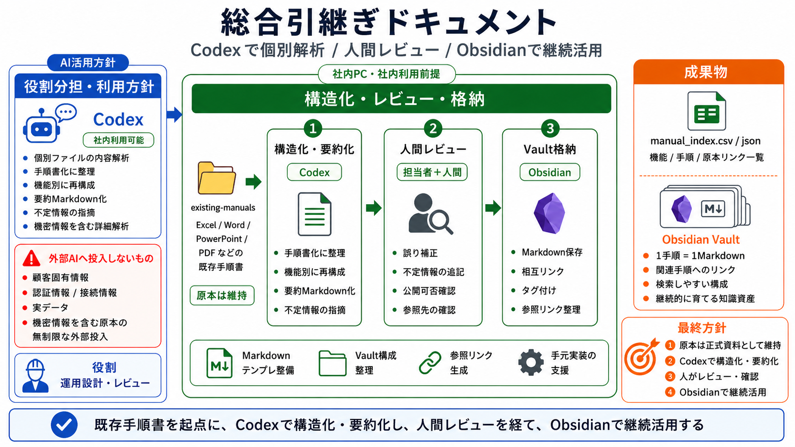
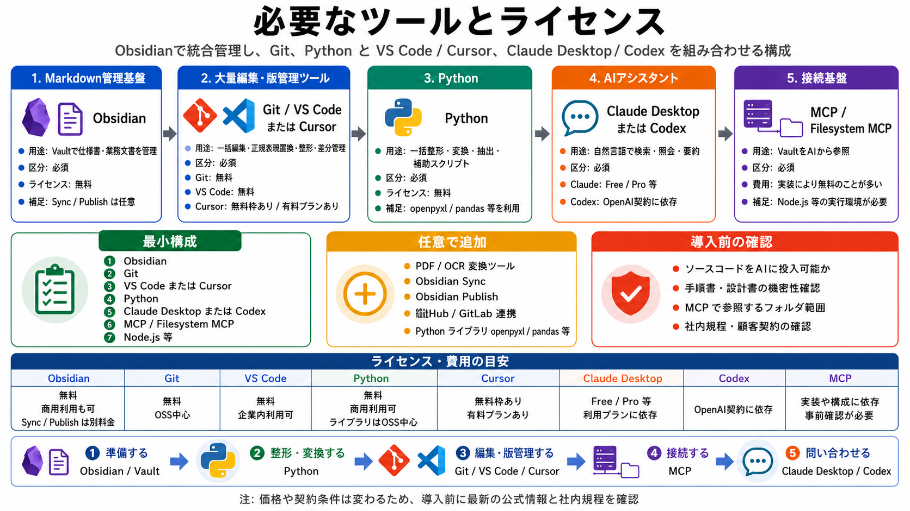
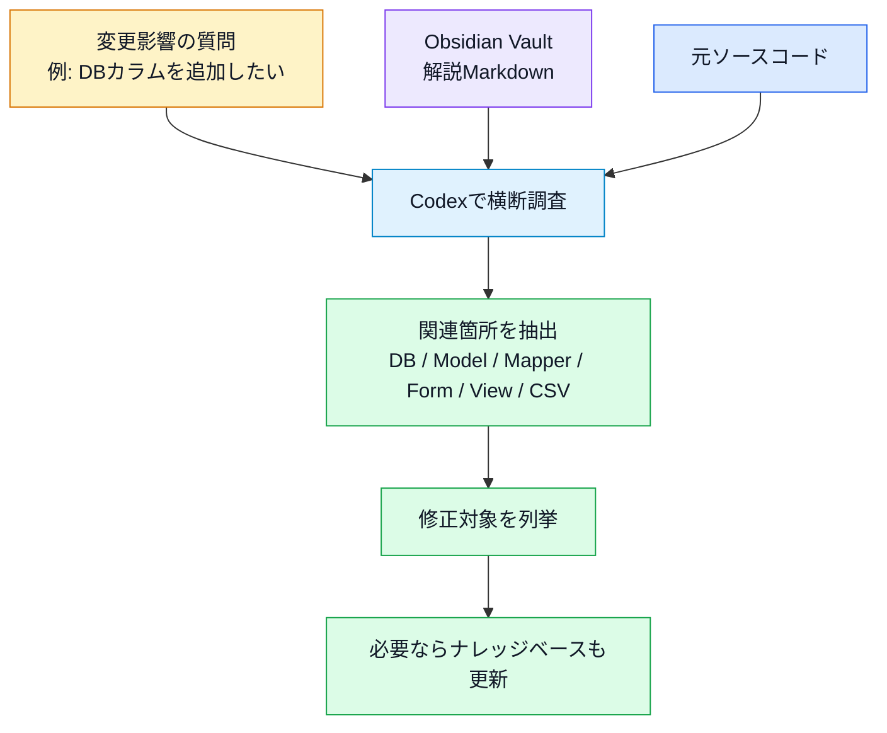
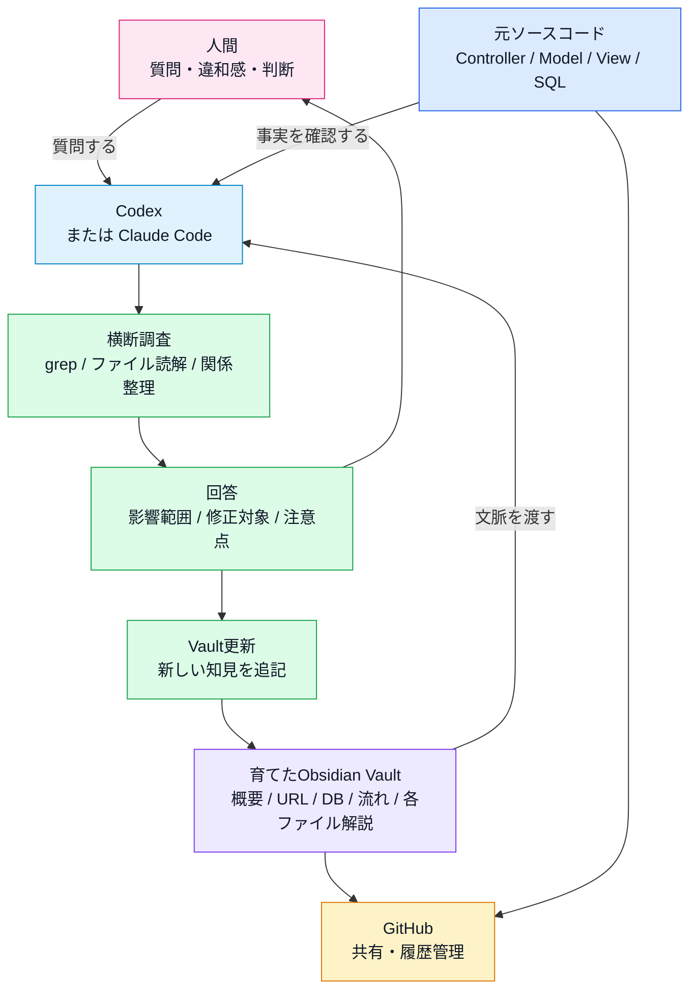

# このナレッジベースの作り方

この資料は、既存アプリのソースコードを **Codexで解析し、Obsidianで育て、GitHubで共有する** ためのナレッジベース。

単にMarkdownを作るのではなく、ソースコードを読み解いた結果を、あとから人が追える形に整理していく。

## 総合引継ぎドキュメントの考え方



このナレッジベースは、既存ソースや既存資料を起点に、Codexで構造化・要約し、人間がレビューして、Obsidian Vaultへ格納する流れで作る。

重要なのは、Codexが作ったMarkdownだけを完成物と考えないこと。原本は正式資料として維持し、ナレッジベースには「人が読める要約」「相互リンク」「参照先」「調査の入口」を整理する。

外部AIに投入してはいけないものは、事前に分けておく。顧客固有情報、認証情報、接続情報、実データ、機密情報を含む原本は、無制限に外部へ渡さない。

## 必要なツールとライセンス



最小構成は、Obsidian、Git、VS CodeまたはCursor、Python、Claude DesktopまたはCodex、MCPまたはFilesystem MCP。必要に応じて、PDF / OCR変換ツール、Obsidian Sync / Publish、GitHub / GitLab連携、Pythonライブラリを追加する。

価格や契約条件は変わるため、導入前に最新の公式情報と社内規程を確認する。特に、AIに投入できる情報の範囲、MCPで参照させるフォルダ範囲、顧客契約上の制約は事前に確認する。

## 作成する主なファイル

```text
対象プロジェクト/
├─ README.md
├─ 元ソース/
└─ 元ソース解説/
   ├─ README.md
   ├─ 01_前提知識.md
   ├─ 02_プログラム概要.md
   ├─ 03_ファイル構成.md
   ├─ 04_ファイル一覧.md
   ├─ 05_URL一覧.md
   ├─ 06_プログラムの流れ.md
   ├─ 07_共通クラス・関数.md
   ├─ 08_データベース.md
   ├─ 09_注意点・改善候補.md
   ├─ 10_脆弱性簡易診断.md
   ├─ 11_ログ出力一覧.md
   ├─ 12_エラー出力一覧.md
   ├─ 詳細仕様と変更ガイド/
   │  ├─ 13_変更影響調査ガイド.md
   │  ├─ 14_データ登録・更新・削除の詳細.md
   │  ├─ 15_画面項目一覧.md
   │  ├─ 16_設定値一覧.md
   │  ├─ 17_未使用・流用元ファイル一覧.md
   │  ├─ 18_改修パターン集.md
   │  ├─ 19_用語集.md
   │  └─ 20_調査プロンプト集.md
   ├─ 各ファイル解説/
   └─ 画面再現/
```

## 作業のポイント

- 最初にCodexへソース全体を読ませる。
- まず全体像、URL、DB、処理の流れを作る。
- そのあと各ファイル解説を作る。
- Obsidianで読みながら、人間が「見づらい」「足りない」「余計」と指摘する。
- 図はMermaidで作ると、ObsidianでもGitHubでも見やすい。
- GitHub対応のため、リンクは `[[...]]` ではなく通常のMarkdownリンクを使う。
- ソースそのものへのリンクより、まず各ファイル解説へのリンクを優先する。
- リンクはページ末尾にまとめるだけでなく、ファイル名や画面名が出てきた場所に直接置く。
- 詳細寄りの資料は、トップ階層を増やしすぎないようにフォルダへ分ける。
- 最後に `README.md` を入口にして、GitHubへpushする。

## リンク設計の方針

ナレッジベースでは、リンクの置き方が読みやすさに直結する。

今回の運用では、次の方針にした。

| リンク対象 | 方針 | 理由 |
| --- | --- | --- |
| ソースファイル | 原則として各ファイル解説へリンクする | いきなりコードへ飛ぶより、役割・処理内容・注意点を先に読めるため |
| 元ソース | 各ファイル解説ページの中からリンクする | 詳細確認したいときだけ実コードへ降りられるため |
| 画面再現PNG | 画面名が出た場所に直接リンクする | URLや画面項目を読んでいる流れで確認できるため |
| 関連資料 | 本文中の関連箇所と、必要最小限の関連リンクに置く | ページ末尾だけにまとめると、どこで使う情報か分かりにくいため |

悪い例:

```md
## 関連ソース

- TicketController.php
- TicketMapper.php
```

この形だと、どの説明がどのファイルに対応するのか読み手が追い直す必要がある。

よい例:

```md
登録・更新処理は [TicketController.php 解説](各ファイル解説/application/controllers/TicketController.php_解説.md) の `saveAction()` が受け取り、
DB保存は [TicketMapper.php 解説](各ファイル解説/application/models/TicketMapper.php_解説.md) の `saveTopic()` が担当する。
```

このように、ファイル名や画面名が出てきた場所に直接リンクを置く。

## 詳細仕様と変更ガイドの分離

基本資料は、読む順番が分かるように `01_` から `12_` までを解説フォルダ直下に置く。

一方、変更影響調査や詳細仕様はページ数が増えやすいので、`詳細仕様と変更ガイド/` に分ける。

今回の分類:

| 場所 | 内容 |
| --- | --- |
| 解説フォルダ直下 | 前提知識、概要、URL、処理の流れ、DB、注意点、ログ、エラー |
| `詳細仕様と変更ガイド/` | 変更影響、データ登録・更新・削除、画面項目、設定値、未使用ファイル、改修パターン、用語、調査プロンプト |

これにより、入口の見通しを保ちながら、詳細資料を増やせる。

## この方法の限界

このナレッジベースは、ソースコードを読むための地図としては有効だが、すべての変更影響を事前に書き切るものではない。

特に、次のような質問は固定のMarkdownだけでは完全には答えにくい。

- データベースの特定カラムを変更したとき、どの画面・処理・CSV出力に影響するか。
- あるControllerの処理を変えたとき、どのViewやModelまで影響するか。
- 共通クラス、Mapper、Helper、View Helperを変更したとき、どの画面や処理に波及するか。
- 未使用に見えるファイルが本当に未使用か。
- 入力フォームの項目を増やしたとき、保存・編集・一覧・CSV・DB定義のどこを直す必要があるか。
- セキュリティ修正を入れる場合、既存仕様とどこで衝突するか。
- 設定ファイルを変更したとき、開発環境・本番環境・ルーティング・DB接続にどう影響するか。
- 画面表示を変えたとき、Layout、View、View Helper、CSSのどこに影響するか。
- ファイルアップロード仕様を変えたとき、フォーム、Controller、保存先、DB、セキュリティ対策にどう影響するか。
- CSV出力仕様を変えたとき、取得SQL、Mapper、Action Helper、ダウンロードファイル名、列名にどう影響するか。
- フレームワークやPHPバージョンを上げるとき、ZF1固有APIや非推奨機能がどこで問題になるか。

たとえば「`tickets` テーブルに `is_done` カラムを追加したら何を修正するべきか」という質問では、単にDB定義を見るだけでは足りない。

実際には、次のようにVault全体を再調査する必要がある。



つまり、このナレッジベースは「すべての答えが書いてある完成品」ではなく、**Codexが追加調査しやすい状態に整理された土台** と考える。

## 変更影響を調べるときの使い方

変更影響を調べたいときは、Codexに次のように依頼する。

```text
このVaultとソース全体を見て、
「ticketsテーブルに is_done カラムを追加する場合」
修正が必要なファイル、理由、修正内容を列挙して。
```

Codexは、次の観点で横断的に調べる。

| 観点 | 確認するもの |
| --- | --- |
| DB | `zf1app_db.sql`、テーブル定義、サンプルデータ |
| Model | `Ticket.php` のプロパティ、getter/setter |
| Mapper | `TicketMapper.php` の保存、取得、CSV用配列 |
| Form | `TopicBootstrapForm.php` の入力項目 |
| Controller | `TicketController.php` の登録、編集、一覧、CSV処理 |
| View | 一覧、登録、編集画面の表示 |
| Docs | DB、プログラム概要、URL、各ファイル解説 |

このように、都度Codexで調べ直すことで、固定ドキュメントでは拾いきれない変更影響を補える。

## 限界の具体例

### DBカラム変更

`tickets` にカラムを追加・削除・リネームする場合、影響はDBだけで終わらない。

確認が必要なもの:

- `zf1app_db.sql` のテーブル定義とサンプルINSERT
- `Ticket.php` のプロパティ、getter、setter
- `TicketMapper.php` の登録、更新、取得、CSV出力
- `TopicBootstrapForm.php` の入力項目
- `ticket/index.phtml` などの表示
- 各ファイル解説、DB解説、プログラム概要

### 共通クラス・Helper変更

共通クラスやHelperは、1か所の変更が複数画面に影響する。

確認が必要なもの:

- そのクラスを直接呼んでいるControllerやView
- `Zend_Controller_Action_HelperBroker` やView Helper経由の呼び出し
- Layoutから間接的に使われる処理
- 画面表示、CSV出力、FlashMessengerなどの横断処理
- 同名・類似Helperが存在する場合の使い分け

例:

- `DisplayDate.php` を変えると、一覧画面の日付表示に影響する。
- `Csv.php` を変えると、CSV出力全体に影響する。
- `layout.phtml` を変えると、全画面のナビゲーションやFlashMessage表示に影響する。
- `TicketMapper.php` を変えると、一覧、登録、編集、削除、CSV出力に影響する。

### ルーティング変更

URLを変える場合、`routes.php` だけではなく、画面内リンクやフォーム送信先も確認する必要がある。

確認が必要なもの:

- `application/configs/routes.php`
- `layout.phtml` のナビゲーション
- `ticket/index.phtml` のEdit/Deleteリンク
- `save.phtml`、`edit.phtml` のform action
- `05_URL一覧.md`
- 画面再現や操作説明

### フォーム項目変更

フォームに項目を追加する場合、画面に出すだけでは足りない。

確認が必要なもの:

- `TopicBootstrapForm.php`
- `TicketController#saveAction`
- `Ticket.php`
- `TicketMapper#saveTopic()`
- DB定義
- 編集時の `populate()`
- 一覧表示やCSV出力に出すかどうか

### 表示変更

一覧画面やレイアウトを変更する場合、View単体ではなく、View HelperやCSSも確認する必要がある。

確認が必要なもの:

- `views/scripts/**/*.phtml`
- `layouts/scripts/layout.phtml`
- `views/helpers/*.php`
- `public/css/app.global.css`
- 画面再現PNG
- URL一覧の画面説明

### セキュリティ修正

脆弱性対応は、単純な置換ではなく既存仕様との兼ね合いを見る必要がある。

確認が必要なもの:

- 削除処理をGETからPOSTへ変える場合の画面リンク、フォーム、ルート
- CSRF対策の有無
- SQL条件の組み立て
- ファイルアップロードの拡張子、保存名、保存先
- エスケープ漏れ
- ZF1自体の古さによる制約

## 運用上の考え方

このナレッジベースは、変更影響をすべて事前に列挙するものではない。

実際の運用では、次のように使う。

1. まずナレッジベースで全体像をつかむ。
2. 変更したい対象を決める。
3. CodexにVaultとソースを横断調査させる。
4. 修正対象ファイル、理由、修正内容、注意点を列挙させる。
5. 実装したら、ナレッジベース側も更新する。

つまり、ナレッジベースは静的な完成資料ではなく、**Codexで再調査するための索引** として使う。

## 完全体はVault + Codex

解析結果として作ったMarkdownは、あくまでナレッジベースの一部。

この方法の完全体は、**育てたObsidian Vault + Codex** である。

Claude Codeのように、ローカルのファイル群を読んで横断調査できるAIエージェントでも同じ考え方で使える。



この図で重要なのは、Markdownファイルだけで完結させようとしないこと。

静的な解析結果だけでは、未来の変更質問には答えきれない。

一方で、Vaultが育っていれば、Codexは次の材料を使って再調査できる。

- すでに整理された全体像
- URLとControllerの対応
- DB構造
- 処理の流れ
- 各ファイル解説
- 注意点・改善候補
- 元ソースコードそのもの

つまり、完成形は次の組み合わせ。

```text
元ソースコード
+ 育てたObsidian Vault
+ CodexなどのAIエージェント
+ GitHubによる共有・履歴管理
```

## 今回の実例

今回の構成は次の形。

```text
ZF1PJ1/
├─ README.md
├─ zend-framework-1-crud-master/
└─ zend-framework-1-crud-master解説/
   ├─ README.md
   ├─ 01_ZendFramework1について.md
   ├─ 02_プログラム概要.md
   ├─ 03_ファイル構成.md
   ├─ 04_ファイル一覧.md
   ├─ 05_URL一覧.md
   ├─ 06_プログラムの流れ.md
   ├─ 07_共通クラス・関数.md
   ├─ 08_データベース.md
   ├─ 09_注意点・改善候補.md
   ├─ 10_脆弱性簡易診断.md
   ├─ 11_ログ出力一覧.md
   ├─ 12_エラー出力一覧.md
   ├─ 詳細仕様と変更ガイド/
   │  ├─ 13_変更影響調査ガイド.md
   │  ├─ 14_データ登録・更新・削除の詳細.md
   │  ├─ 15_画面項目一覧.md
   │  ├─ 16_設定値一覧.md
   │  ├─ 17_未使用・流用元ファイル一覧.md
   │  ├─ 18_改修パターン集.md
   │  ├─ 19_用語集.md
   │  └─ 20_調査プロンプト集.md
   ├─ 各ファイル解説/
   └─ 画面再現/
```

## まとめ

この作り方の中心は、次の流れ。

```text
ソースコード
↓
Codexによる解析
↓
Obsidianで育てる
↓
GitHubで共有する
```

つまり、これは **Codex + Obsidian + GitHub で作るコード引き継ぎ資料**。

## 今回採用されたプロンプト

今回の作業では、次のような指示が有効だった。

そのまま使うというより、対象プロジェクト名や作りたいページ名を差し替えて使う。

### 1. URL一覧を作る

```text
これから、対象アプリを解析してmd形式でメモを取っていきます。
まず、URL一覧を作成して、
対象アプリ解説
に、URL一覧.md を作成してください。
```

効果:

- 最初にアプリの入口を把握できる。
- Controller、Action、HTTPメソッド、画面の対応が整理される。
- あとの画面再現や処理フロー作成の土台になる。

### 2. プログラムの流れを作る

```text
今解析した、プログラムの流れをmdにしたい。
URL一覧と同じ場所に、プログラムの流れ.mdでファイルを作って、
最初に解析したファイル
↓
routes.php
↓
みたいに、図示して。
```

効果:

- 入口ファイルからController、Model、Viewまでの流れを追える。
- 新しく引き継ぐ人が「どこから読めばよいか」を理解しやすい。

### 3. プログラム全体を説明する

```text
プログラム全体を読んで、プログラム概要.md を作成して。
```

効果:

- 機能、構成、主要クラス、注意点を1ページに集約できる。
- いきなり各ファイルを読む前の地図になる。

### 4. DBとER図を作る

```text
データベースのテーブル一覧と、ER図も欲しい。
```

効果:

- SQL定義からテーブル構造を整理できる。
- ModelやMapperを読むときの前提になる。

### 5. 静的な画面再現を作る

```text
プログラムの解説として使いたいので静的なもので十分。
画面再現フォルダを作ってください。
htmlでなく、pngで。
```

効果:

- 実行環境がなくても画面イメージを共有できる。
- URL一覧や画面説明と結びつけられる。

### 6. 各ファイル解説を作る

```text
各ファイルの解説がほしい。
今までのmdを置いたフォルダの下に「各ファイル解説」フォルダを作り、
元のコードと同じフォルダ構成とファイル配置で、
ファイル名_解説.md を作成して。
```

効果:

- ソース単位で役割、処理内容、関連ファイルを追える。
- 変更影響調査の材料になる。

### 7. 各ファイル解説に詳細を足す

```text
各ファイルの解説しているmdなんだけど、
今の概要の下に、詳細な内容も入れてほしい。
```

効果:

- 1行説明だけでなく、処理の中身まで追える。
- Codexがあとで再調査するときの文脈が増える。

### 8. ソースへのリンクを付ける

```text
各、解説.mdには、ソースへのリンクもつけてください。
```

効果:

- 解説から実コードへすぐ戻れる。
- GitHub上でも読みやすい資料になる。

### 9. 共通クラス・関数をまとめる

```text
共通で利用されているクラスや関数をまとめてmdファイルにして。
ZF固有のは不要です。
```

効果:

- アプリ固有の再利用部品を把握できる。
- 変更影響が大きい箇所を見つけやすい。

### 10. 引き継ぎ用に読む順番を整える

```text
これを引き継ぎ資料にしたい。
その場合、どういう順番で読むのがいいのか、
他に必要な情報がないか提案して。
```

効果:

- 単なるメモから、引き継ぎ用ナレッジベースに変わる。
- 注意点、改善候補、脆弱性診断などの不足ページを洗い出せる。

### 11. Mermaidでビジュアル化する

```text
プログラム概要なんだけど、Mermaidとか使って、
もっとビジュアルを人間にやさしくしたい。
```

効果:

- 文章だけでは追いにくい流れを図で見られる。
- ObsidianでもGitHubでも表示できる。

### 12. 既存ページを図解する

```text
06_プログラムの流れ
も、同様に図にして。
```

効果:

- 既存のテキスト説明を残しながら、理解しやすい図を追加できる。
- 読み手の理解スタイルに合わせられる。

### 13. GitHub対応する

```text
GitHub対応して。
```

効果:

- `README.md` を入口にできる。
- Obsidian専用記法を避け、GitHub上でも読める資料になる。

### 14. GitHubへ保存する

```text
ここ。
https://github.com/ユーザー名/リポジトリ名
```

効果:

- ローカルVaultをGit管理し、GitHubへpushできる。
- 共有と履歴管理ができる。

### 15. 作り方自体をナレッジ化する

```text
そこを図にして、このナレッジベースの作り方.md を作って。
```

効果:

- 今回の作業手順そのものを再利用可能な知識にできる。
- 次のプロジェクトでも同じ型を使える。

### 16. 限界を明記する

```text
この方法の限界についても記述してほしい。
たとえば、
・データベース xxカラムを変更したときの影響は？
のような質問に対しては、全てを記述することはできないので、
Vaultに対してCodexで調査する必要がある。
```

効果:

- 静的ドキュメントだけでは不十分なことを明示できる。
- Vault + Codexで再調査する運用に位置づけられる。

### 17. 完全体を定義する

```text
解析結果はあくまでナレッジベースの一部であり、
完全体は、育てたObsidian Vault + Codexである。
これも追記したうえで、完全体システムを図にしてみて。
```

効果:

- Markdownファイルだけを完成品と誤解しないようにできる。
- 人間、Vault、ソース、Codex、GitHubの関係を整理できる。

### 18. 詳細仕様ページを追加する

```text
他にもあったら嬉しいドキュメントの候補を考えて。
ログ出力一覧と、エラー出力一覧はあった方が良いと思う。
```

```text
いいね。全部作って。
```

効果:

- 引き継ぎ時に不足しがちな運用・変更系の資料を増やせる。
- ログ、エラー、設定、画面項目、改修パターンなど、実務で見るページを追加できる。

### 19. リンクを使う場所に直接置く

```text
ソースへのリンクは後ろにつけるんじゃなくて使っているところにつけて。
```

効果:

- 読んでいる説明から、すぐ関連する解説ページへ移動できる。
- 末尾のリンク集だけを見て対応関係を推測する必要がなくなる。

### 20. ソース直リンクではなく各ファイル解説へリンクする

```text
この形式で、やっぱりファイルじゃなくて、ファイルの解説mdにリンクしてほしい。
そして追記のうち13-20はフォルダ「詳細仕様と変更ガイド」の配下に入れて。
```

効果:

- 詳細ページから各ファイル解説へつながるため、コードを読む前に役割と注意点を確認できる。
- 詳細仕様・変更ガイド系のページをフォルダにまとめ、トップ階層を見やすく保てる。

## プロンプト運用のコツ

- 最初は大きく読ませる。
- 次にページ単位でMarkdown化させる。
- Obsidianで見て、人間が違和感を指摘する。
- Codexには「対象ファイルだけ」「このページだけ」と範囲を明示する。
- 図にしたいときは「Mermaidで」「色分けして」と指定する。
- GitHubでも使うなら、通常Markdownリンクに寄せる。
- ファイル名が出てきた場所には、各ファイル解説へのリンクを直接置く。
- 画面名が出てきた場所には、画面再現PNGへのリンクを直接置く。
- 詳細仕様や変更ガイドは、トップ階層を圧迫しないように専用フォルダへ分ける。
- 変更影響の質問は、固定資料だけで答えさせず、Vaultとソースを横断調査させる。
