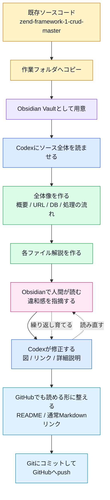
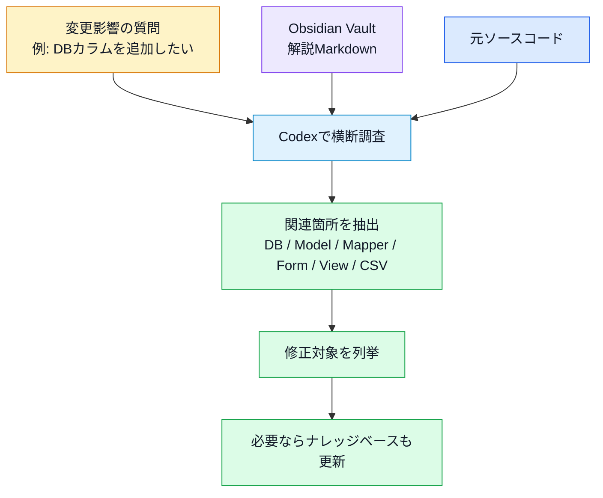
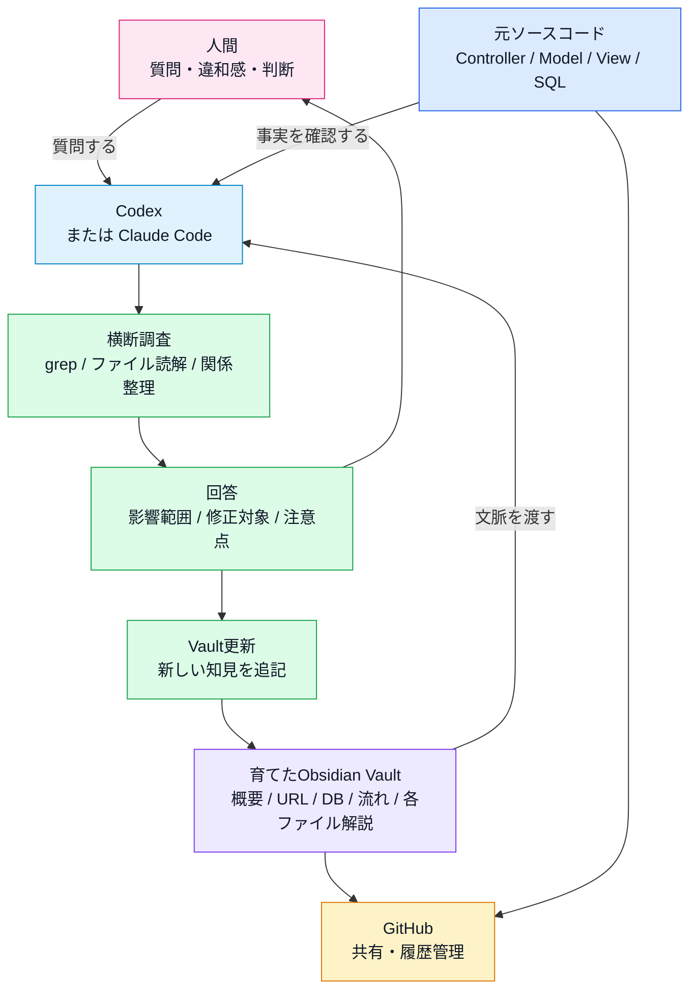

# このナレッジベースの作り方

この資料は、既存アプリのソースコードを **Codexで解析し、Obsidianで育て、GitHubで共有する** ためのナレッジベース。

単にMarkdownを作るのではなく、ソースコードを読み解いた結果を、あとから人が追える形に整理していく。

## 全体の流れ



## 役割分担

| 役割 | 担当 | 内容 |
| --- | --- | --- |
| ソースを読む | Codex | Controller、Model、View、設定、DB定義を横断して読む。 |
| 構造化する | Codex | URL一覧、プログラム概要、処理の流れ、DB、共通クラスをMarkdown化する。 |
| 違和感を見つける | 人間 | Obsidianで読み、見づらい点・足りない点・余計な点を指摘する。 |
| 育てる | 人間 + Codex | 図、リンク、各ファイル解説、注意点を追加・修正する。 |
| 共有する | GitHub | READMEを入口にして、ブラウザ上でも読める形で保存する。 |

## 作成する主なファイル

```text
対象プロジェクト/
├─ README.md
├─ 元ソース/
└─ 元ソース解説/
   ├─ README.md
   ├─ 01_前提知識.md
   ├─ 02_プログラム概要.md
   ├─ 03_ファイル構成.md
   ├─ 04_ファイル構成一覧.md
   ├─ 05_URL一覧.md
   ├─ 06_プログラムの流れ.md
   ├─ 07_共通クラス・関数.md
   ├─ 08_データベース.md
   ├─ 09_注意点・改善候補.md
   ├─ 10_脆弱性簡易診断.md
   ├─ 各ファイル解説/
   └─ 画面再現/
```

## 作業のポイント

- 最初にCodexへソース全体を読ませる。
- まず全体像、URL、DB、処理の流れを作る。
- そのあと各ファイル解説を作る。
- Obsidianで読みながら、人間が「見づらい」「足りない」「余計」と指摘する。
- 図はMermaidで作ると、ObsidianでもGitHubでも見やすい。
- GitHub対応のため、リンクは `[[...]]` ではなく通常のMarkdownリンクを使う。
- 最後に `README.md` を入口にして、GitHubへpushする。

## この方法の限界

このナレッジベースは、ソースコードを読むための地図としては有効だが、すべての変更影響を事前に書き切るものではない。

特に、次のような質問は固定のMarkdownだけでは完全には答えにくい。

- データベースの特定カラムを変更したとき、どの画面・処理・CSV出力に影響するか。
- あるControllerの処理を変えたとき、どのViewやModelまで影響するか。
- 共通クラス、Mapper、Helper、View Helperを変更したとき、どの画面や処理に波及するか。
- 未使用に見えるファイルが本当に未使用か。
- 入力フォームの項目を増やしたとき、保存・編集・一覧・CSV・DB定義のどこを直す必要があるか。
- セキュリティ修正を入れる場合、既存仕様とどこで衝突するか。
- 設定ファイルを変更したとき、開発環境・本番環境・ルーティング・DB接続にどう影響するか。
- 画面表示を変えたとき、Layout、View、View Helper、CSSのどこに影響するか。
- ファイルアップロード仕様を変えたとき、フォーム、Controller、保存先、DB、セキュリティ対策にどう影響するか。
- CSV出力仕様を変えたとき、取得SQL、Mapper、Action Helper、ダウンロードファイル名、列名にどう影響するか。
- フレームワークやPHPバージョンを上げるとき、ZF1固有APIや非推奨機能がどこで問題になるか。

たとえば「`tickets` テーブルに `is_done` カラムを追加したら何を修正するべきか」という質問では、単にDB定義を見るだけでは足りない。

実際には、次のようにVault全体を再調査する必要がある。



つまり、このナレッジベースは「すべての答えが書いてある完成品」ではなく、**Codexが追加調査しやすい状態に整理された土台** と考える。

## 変更影響を調べるときの使い方

変更影響を調べたいときは、Codexに次のように依頼する。

```text
このVaultとソース全体を見て、
「ticketsテーブルに is_done カラムを追加する場合」
修正が必要なファイル、理由、修正内容を列挙して。
```

Codexは、次の観点で横断的に調べる。

| 観点 | 確認するもの |
| --- | --- |
| DB | `zf1app_db.sql`、テーブル定義、サンプルデータ |
| Model | `Ticket.php` のプロパティ、getter/setter |
| Mapper | `TicketMapper.php` の保存、取得、CSV用配列 |
| Form | `TopicBootstrapForm.php` の入力項目 |
| Controller | `TicketController.php` の登録、編集、一覧、CSV処理 |
| View | 一覧、登録、編集画面の表示 |
| Docs | DB、プログラム概要、URL、各ファイル解説 |

このように、都度Codexで調べ直すことで、固定ドキュメントでは拾いきれない変更影響を補える。

## 限界の具体例

### DBカラム変更

`tickets` にカラムを追加・削除・リネームする場合、影響はDBだけで終わらない。

確認が必要なもの:

- `zf1app_db.sql` のテーブル定義とサンプルINSERT
- `Ticket.php` のプロパティ、getter、setter
- `TicketMapper.php` の登録、更新、取得、CSV出力
- `TopicBootstrapForm.php` の入力項目
- `ticket/index.phtml` などの表示
- 各ファイル解説、DB解説、プログラム概要

### 共通クラス・Helper変更

共通クラスやHelperは、1か所の変更が複数画面に影響する。

確認が必要なもの:

- そのクラスを直接呼んでいるControllerやView
- `Zend_Controller_Action_HelperBroker` やView Helper経由の呼び出し
- Layoutから間接的に使われる処理
- 画面表示、CSV出力、FlashMessengerなどの横断処理
- 同名・類似Helperが存在する場合の使い分け

例:

- `DisplayDate.php` を変えると、一覧画面の日付表示に影響する。
- `Csv.php` を変えると、CSV出力全体に影響する。
- `layout.phtml` を変えると、全画面のナビゲーションやFlashMessage表示に影響する。
- `TicketMapper.php` を変えると、一覧、登録、編集、削除、CSV出力に影響する。

### ルーティング変更

URLを変える場合、`routes.php` だけではなく、画面内リンクやフォーム送信先も確認する必要がある。

確認が必要なもの:

- `application/configs/routes.php`
- `layout.phtml` のナビゲーション
- `ticket/index.phtml` のEdit/Deleteリンク
- `save.phtml`、`edit.phtml` のform action
- `05_URL一覧.md`
- 画面再現や操作説明

### フォーム項目変更

フォームに項目を追加する場合、画面に出すだけでは足りない。

確認が必要なもの:

- `TopicBootstrapForm.php`
- `TicketController#saveAction`
- `Ticket.php`
- `TicketMapper#saveTopic()`
- DB定義
- 編集時の `populate()`
- 一覧表示やCSV出力に出すかどうか

### 表示変更

一覧画面やレイアウトを変更する場合、View単体ではなく、View HelperやCSSも確認する必要がある。

確認が必要なもの:

- `views/scripts/**/*.phtml`
- `layouts/scripts/layout.phtml`
- `views/helpers/*.php`
- `public/css/app.global.css`
- 画面再現PNG
- URL一覧の画面説明

### セキュリティ修正

脆弱性対応は、単純な置換ではなく既存仕様との兼ね合いを見る必要がある。

確認が必要なもの:

- 削除処理をGETからPOSTへ変える場合の画面リンク、フォーム、ルート
- CSRF対策の有無
- SQL条件の組み立て
- ファイルアップロードの拡張子、保存名、保存先
- エスケープ漏れ
- ZF1自体の古さによる制約

## 運用上の考え方

このナレッジベースは、変更影響をすべて事前に列挙するものではない。

実際の運用では、次のように使う。

1. まずナレッジベースで全体像をつかむ。
2. 変更したい対象を決める。
3. CodexにVaultとソースを横断調査させる。
4. 修正対象ファイル、理由、修正内容、注意点を列挙させる。
5. 実装したら、ナレッジベース側も更新する。

つまり、ナレッジベースは静的な完成資料ではなく、**Codexで再調査するための索引** として使う。

## 完全体はVault + Codex

解析結果として作ったMarkdownは、あくまでナレッジベースの一部。

この方法の完全体は、**育てたObsidian Vault + Codex** である。

Claude Codeのように、ローカルのファイル群を読んで横断調査できるAIエージェントでも同じ考え方で使える。



この図で重要なのは、Markdownファイルだけで完結させようとしないこと。

静的な解析結果だけでは、未来の変更質問には答えきれない。

一方で、Vaultが育っていれば、Codexは次の材料を使って再調査できる。

- すでに整理された全体像
- URLとControllerの対応
- DB構造
- 処理の流れ
- 各ファイル解説
- 注意点・改善候補
- 元ソースコードそのもの

つまり、完成形は次の組み合わせ。

```text
元ソースコード
+ 育てたObsidian Vault
+ CodexなどのAIエージェント
+ GitHubによる共有・履歴管理
```

## 今回の実例

今回の構成は次の形。

```text
ZF1PJ1/
├─ README.md
├─ zend-framework-1-crud-master/
└─ zend-framework-1-crud-master解説/
   ├─ README.md
   ├─ 01_ZendFramework1について.md
   ├─ 02_プログラム概要.md
   ├─ 03_ファイル構成.md
   ├─ 04_ファイル構成一覧.md
   ├─ 05_URL一覧.md
   ├─ 06_プログラムの流れ.md
   ├─ 07_共通クラス・関数.md
   ├─ 08_データベース.md
   ├─ 09_注意点・改善候補.md
   ├─ 10_脆弱性簡易診断.md
   ├─ 各ファイル解説/
   └─ 画面再現/
```

## まとめ

この作り方の中心は、次の流れ。

```text
ソースコード
↓
Codexによる解析
↓
Obsidianで育てる
↓
GitHubで共有する
```

つまり、これは **Codex + Obsidian + GitHub で作るコード引き継ぎ資料**。
