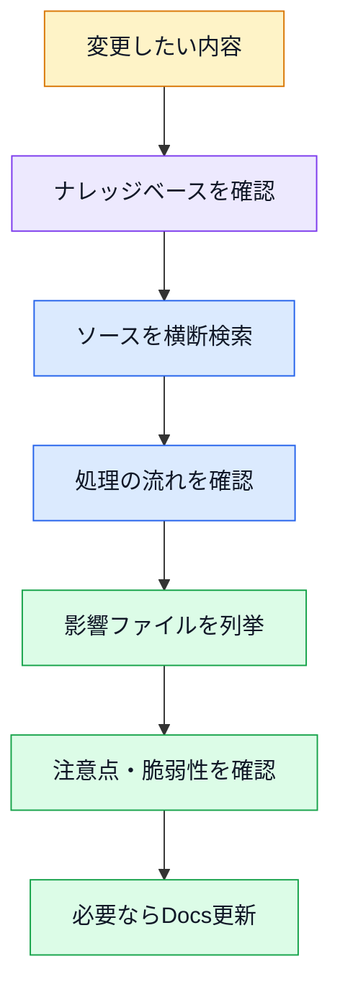

# 変更影響調査ガイド

対象アプリ: `zend-framework-1-crud-master`

## 目的

このページは、機能変更や仕様変更を行う前に「どこへ影響するか」を調べるための入口。

固定のMarkdownだけですべての影響を列挙するのではなく、VaultとソースをCodexで横断調査する前提で使う。

## 基本の調査フロー



## 変更パターン別の確認先

| 変更内容 | 主に見るファイル | あわせて見る資料 |
| --- | --- | --- |
| DBカラム追加 | [`zf1app_db.sql`](../各ファイル解説/zf1app_db.sql_解説.md), [`Ticket.php`](../各ファイル解説/application/models/Ticket.php_解説.md), [`TicketMapper.php`](../各ファイル解説/application/models/TicketMapper.php_解説.md), [`TopicBootstrapForm.php`](../各ファイル解説/application/forms/TopicBootstrapForm.php_解説.md), [`ticket/index.phtml`](../各ファイル解説/application/views/scripts/ticket/index.phtml_解説.md) | [08_データベース.md](../08_データベース.md) |
| 一覧列追加 | [`ticket/index.phtml`](../各ファイル解説/application/views/scripts/ticket/index.phtml_解説.md), [`TicketMapper.php`](../各ファイル解説/application/models/TicketMapper.php_解説.md), [`Ticket.php`](../各ファイル解説/application/models/Ticket.php_解説.md) | [15_画面項目一覧.md](15_画面項目一覧.md) |
| 入力項目追加 | [`TopicBootstrapForm.php`](../各ファイル解説/application/forms/TopicBootstrapForm.php_解説.md), [`TicketController.php`](../各ファイル解説/application/controllers/TicketController.php_解説.md), [`Ticket.php`](../各ファイル解説/application/models/Ticket.php_解説.md), [`TicketMapper.php`](../各ファイル解説/application/models/TicketMapper.php_解説.md) | [18_改修パターン集.md](18_改修パターン集.md) |
| CSV列追加 | [`TicketController.php`](../各ファイル解説/application/controllers/TicketController.php_解説.md), [`TicketMapper.php`](../各ファイル解説/application/models/TicketMapper.php_解説.md), [`Csv.php`](../各ファイル解説/application/helpers/Csv.php_解説.md) | [05_URL一覧.md](../05_URL一覧.md) |
| URL変更 | [`routes.php`](../各ファイル解説/application/configs/routes.php_解説.md), [`layout.phtml`](../各ファイル解説/application/layouts/scripts/layout.phtml_解説.md), [`ticket/index.phtml`](../各ファイル解説/application/views/scripts/ticket/index.phtml_解説.md), [`save.phtml`](../各ファイル解説/application/views/scripts/ticket/save.phtml_解説.md), [`edit.phtml`](../各ファイル解説/application/views/scripts/ticket/edit.phtml_解説.md) | [05_URL一覧.md](../05_URL一覧.md) |
| 共通レイアウト変更 | [`layout.phtml`](../各ファイル解説/application/layouts/scripts/layout.phtml_解説.md), [`app.global.css`](../各ファイル解説/public/css/app.global.css_解説.md) | [15_画面項目一覧.md](15_画面項目一覧.md) |
| Helper変更 | `application/helpers/*`, `views/helpers/*`, 呼び出し元View/Controller | [07_共通クラス・関数.md](../07_共通クラス・関数.md) |
| エラー処理変更 | [`ErrorController.php`](../各ファイル解説/application/controllers/ErrorController.php_解説.md), [`error/error.phtml`](../各ファイル解説/application/views/scripts/error/error.phtml_解説.md), [`application.ini`](../各ファイル解説/application/configs/application.ini_解説.md) | [12_エラー出力一覧.md](../12_エラー出力一覧.md) |
| ログ追加 | [`application.ini`](../各ファイル解説/application/configs/application.ini_解説.md), [`ErrorController.php`](../各ファイル解説/application/controllers/ErrorController.php_解説.md), 追加したいController/Mapper | [11_ログ出力一覧.md](../11_ログ出力一覧.md) |

## Codexに投げる質問例

```text
このVaultとソース全体を見て、
「ticketsテーブルに is_done カラムを追加する場合」
修正が必要なファイル、理由、修正内容、注意点を列挙して。
```

```text
このVaultとソース全体を見て、
TicketMapper.php の saveTopic() を変更した場合、
影響する画面・処理・ドキュメントを列挙して。
```

```text
このVaultとソース全体を見て、
CSV出力に priority を追加する場合の修正箇所を、
Controller / Mapper / Helper / Docs に分けて列挙して。
```

## 調査時の注意

- ファイル名検索だけでは足りない。ZF1の命名規約やHelper呼び出しも見る。
- `View Helper` はView内でメソッドのように呼ばれる。
- `Action Helper` はControllerから `$this->_helper` 経由で呼ばれる。
- [`routes.php`](../各ファイル解説/application/configs/routes.php_解説.md) のルート名と実URL名がずれている箇所がある。
- 編集画面のPOST先は `/ticket/create`。
- 登録と更新はどちらも `saveAction()` が担当する。

## 関連

- [このナレッジベースの作り方.md](../このナレッジベースの作り方.md)
- [06_プログラムの流れ.md](../06_プログラムの流れ.md)
- [07_共通クラス・関数.md](../07_共通クラス・関数.md)
- [09_注意点・改善候補.md](../09_注意点・改善候補.md)


