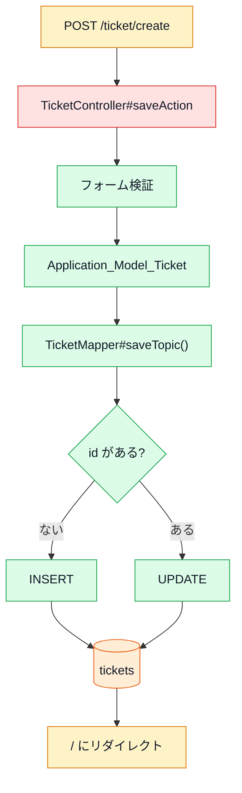

# データ登録・更新・削除の詳細

対象アプリ: `zend-framework-1-crud-master`

## 対象処理

このページでは、チケットの登録・更新・削除をDB視点で整理する。

| 処理 | URL | Controller | DB操作 |
| --- | --- | --- | --- |
| 新規登録 | `POST /ticket/create` | `TicketController#saveAction` | `INSERT` |
| 更新 | `POST /ticket/create` | `TicketController#saveAction` | `UPDATE` |
| 削除 | `GET /ticket/delete/:id` | `TicketController#deleteAction` | `DELETE` |

## 登録・更新の共通入口

登録と更新はどちらも `TicketController#saveAction` が担当する。

違いはhidden項目 `id` の有無。



## INSERT

実行箇所:

- `Application_Model_TicketMapper#saveTopic()`

条件:

- `$ticket->getId()` が `null`

保存データ:

| DBカラム | 値の元 |
| --- | --- |
| `title` | `$ticket->getTitle()` |
| `notes` | `$ticket->getNotes()` |
| `created_at` | `date('Y-m-d H:i:s')` |
| `files` | `$ticket->getFiles()` |
| `priority` | `$ticket->getPriority()` |

## UPDATE

実行箇所:

- `Application_Model_TicketMapper#saveTopic()`

条件:

- `$ticket->getId()` が存在する

更新条件:

```php
array('id = ?' => $id)
```

注意:

- `created_at` も更新データに含まれているため、更新時に作成日時が書き換わる可能性がある。
- `updated_at` はDBの `ON UPDATE CURRENT_TIMESTAMP` に任せている。

## DELETE

実行箇所:

- `TicketController#deleteAction`
- `Application_Model_TicketMapper#deleteTopic($id)`

削除条件:

```php
"id = $id"
```

注意:

- URLは `GET /ticket/delete/:id`。
- 削除処理がGETで実行される。
- `deleteTopic($id)` は文字列連結で条件を作っている。
- ルート定義では `id` は数字制約があるが、Mapper単体では安全ではない。

## 関連

- [06_プログラムの流れ.md](../06_プログラムの流れ.md)
- [08_データベース.md](../08_データベース.md)
- [10_脆弱性簡易診断.md](../10_脆弱性簡易診断.md)
- [TicketMapper.php 解説](../各ファイル解説/application/models/TicketMapper.php_解説.md)


